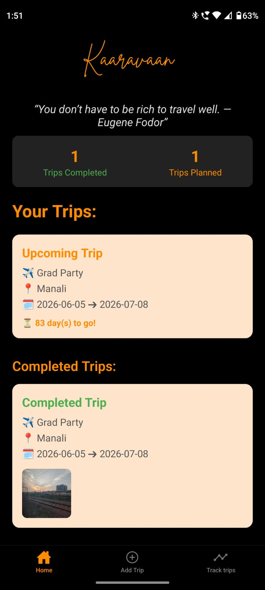
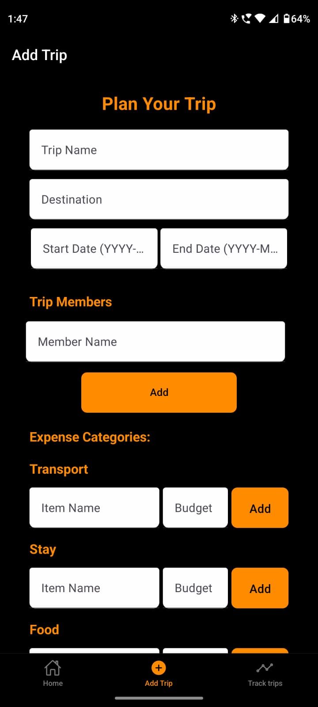
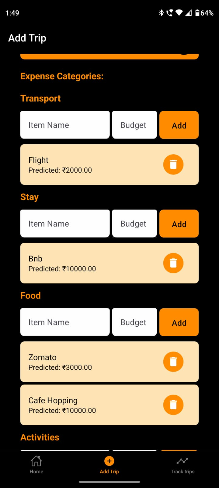
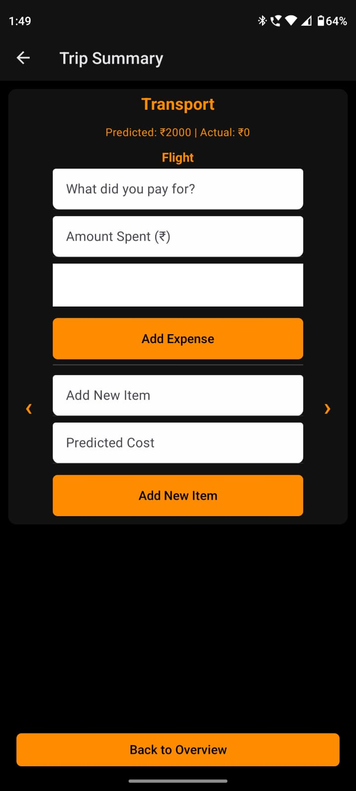
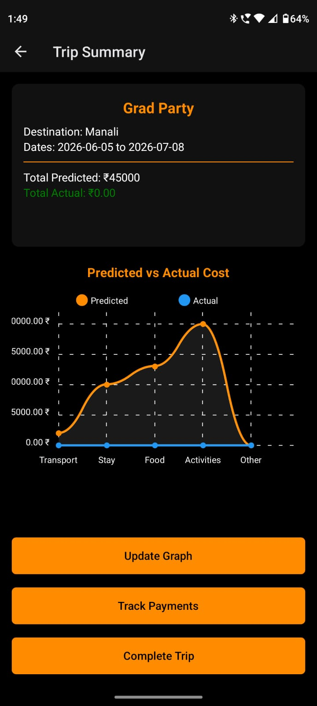
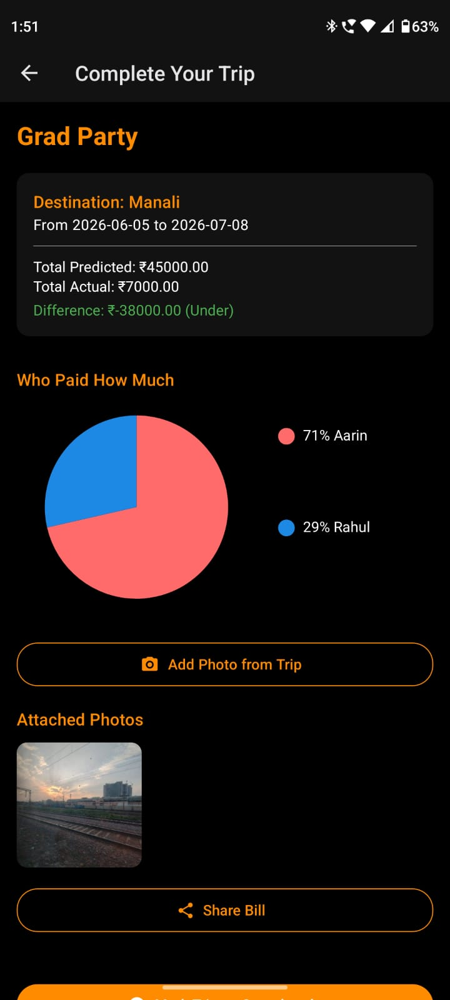
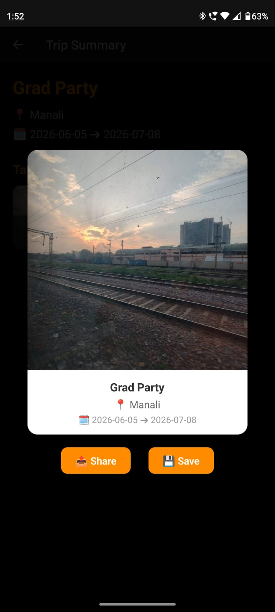
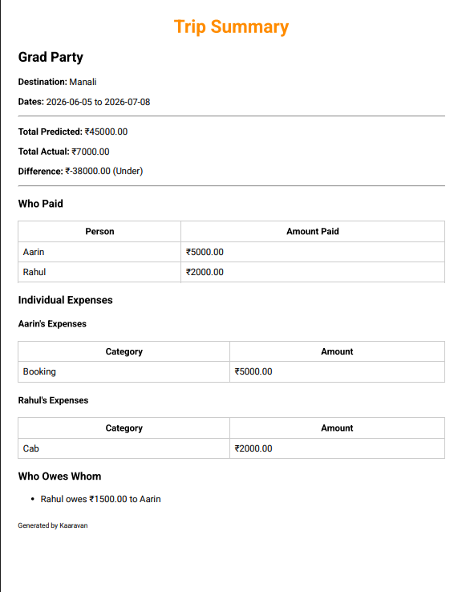

# Kaaravaan – Offline Trip Planner & Expense Tracker

Kaaravaan is an **offline-first mobile application** that allows users to plan trips and track expenses without requiring an internet connection. The app ensures reliable access to trip details and expense data even in low or no connectivity environments.

The goal of this project was to build a lightweight and reliable mobile tool for travelers where trip planning and expense tracking work seamlessly **without network dependency**.

---

## Features

- Create and manage trips
- Plan itineraries for trips
- Track expenses for each trip
- Offline-first functionality (works without internet)
- Local data persistence across app restarts
- Expense analytics and summaries
- Trip photo gallery
- Polaroid-style memory creator

---

## Tech Stack

**Mobile App**
- React Native
- TypeScript
- Expo

**State Management**
- React Hooks

**Storage**
- Local persistent storage

**UI**
- React Native components
- Custom UI layouts

---

## Screenshots

<table>
<tr>
<td></td>
<td></td>
<td></td>
</tr>

<tr>
<td></td>
<td></td>
<td></td>
</tr>

<tr>
<td></td>
<td></td>
<td></td>
</tr>
</table>

---

## Installation

### 1. Clone the repository

```bash
git clone https://github.com/AarinK/Kaaravaan.git
```

### 2. Navigate to the project folder

```bash
cd Kaaravaan
```

### 3. Install dependencies

```bash
npm install
```

### 4. Start the development server

```bash
npx expo start
```

You can run the application using:

- **Expo Go (Mobile Device)**
- **Android Emulator**
- **iOS Simulator**

---

## Project Structure

```
Kaaravaan
│
├── components        # Reusable UI components
├── screens           # Application screens
├── assets            # Static assets and images
├── utils             # Utility functions
├── screenshots       # README screenshots
└── App.tsx           # Application entry point
```

---

## Key Learnings

While building this project, I gained practical experience with:

- Designing **offline-first mobile applications**
- Managing **local data persistence**
- Building modular **React Native components**
- Structuring scalable **mobile app architecture**
- Implementing **expense tracking and analytics**

---

## Future Improvements

- Cloud sync for multi-device access
- Group trip expense sharing
- Budget alerts and notifications
- Exportable trip reports
- AI-based trip planning suggestions

---

## Author

**Aarin Kachroo**

GitHub: https://github.com/AarinK  
LinkedIn: https://www.linkedin.com/in/aarinkachroo/

---

## License

This project is open-source and available under the **MIT License**.
